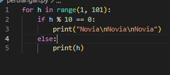
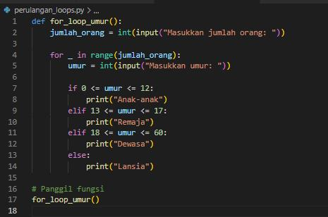
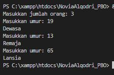
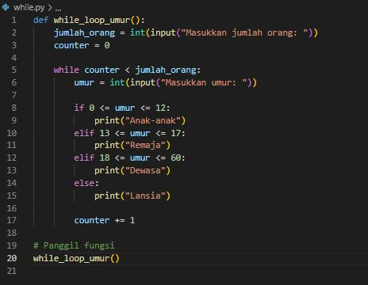
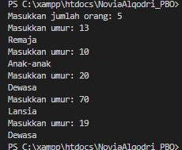
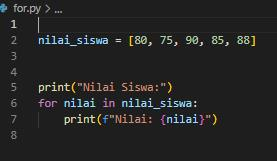
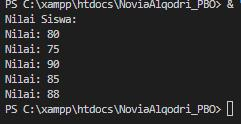

# _Pemrograman Berbasis Objek_

## 1. _Buatlah perulangan hingga 100 menggunakan Python_

### Luaran

1
2
3
4
5
6
7
8
9
Novia
Novia
Novia
11
12
13
14
15
16
17
18
19
Novia
Novia
Novia
21
22
23
24
25
26
27
28
29
Novia
Novia
Novia
31
32
33
34
35
36
37
38
39
Novia
Novia
Novia
41
42
43
44
45
46
47
48
49
Novia
Novia
Novia
51
52
53
54
55
56
57
58
59
Novia
Novia
Novia
61
62
63
64
65
66
67
68
69
Novia
Novia
Novia
71
72
73
74
75
76
77
78
79
Novia
Novia
Novia
81
82
83
84
85
86
87
88
89
Novia
Novia
Novia
91
92
93
94
95
96
97
98
99
Novia
Novia
Novia

### Penjelasan

- for h in range(1, 101) :
Membuat perulangan for yang menggunakan variabel iterasi h untuk mengambil nilai dari 1 hingga 100. Ini berarti perulangan akan berjalan dari 1 sampai dengan 100.

- if h % 10 == 0 :
Pernyataan if digunakan untuk memeriksa apakah nilai h habis dibagi 10 tanpa sisa, yang menunjukkan bahwa h adalah kelipatan 10.

- print("Novia\nNovia\nNovia") :
Jika nilai h adalah kelipatan 10, maka program akan mencetak tiga baris "Novia" dengan menggunakan karakter \n untuk membuat baris baru setelah setiap "Novia".

- else :
Blok else yang akan dieksekusi jika kondisi pada if tidak terpenuhi, artinya nilai h bukan kelipatan 10.

- print(h) :
Jika nilai h bukan kelipatan 10, maka program akan mencetak nilai h.

## 2. _ Buatlah program bebas, dengan menerapkan if else pada :_
### a. _For Loops_

### Luaran

### Penjelasan

## Penjelasan (For Loop)

- **`def for_loop_example():`**: Mendefinisikan fungsi `for_loop_example()`.
- **`total_even = 0`**: Inisialisasi variabel `total_even` untuk menyimpan jumlah angka genap.
- **`total_odd = 0`**: Inisialisasi variabel `total_odd` untuk menyimpan jumlah angka ganjil.
- **`num_of_inputs = int(input("Masukkan jumlah angka yang ingin dimasukkan: "))`**: Meminta pengguna memasukkan jumlah angka yang ingin dimasukkan dan menyimpannya dalam variabel `num_of_inputs`.
- **`for _ in range(num_of_inputs):`**: Membuat perulangan for yang berjalan sebanyak `num_of_inputs` kali. Pengguna diminta memasukkan angka pada setiap iterasi.
- **`angka = int(input("Masukkan angka: "))`**: Meminta pengguna memasukkan angka dan menyimpannya dalam variabel `angka`.
- **`if angka % 2 == 0:`**: Pernyataan `if` untuk memeriksa apakah angka adalah genap.
- **`total_even += 1`**: Jika genap, tambahkan 1 ke `total_even`.
- **`else:`**: Blok `else` untuk menghandle angka ganjil.
- **`total_odd += 1`**: Jika ganjil, tambahkan 1 ke `total_odd`.
- **`print(f"Jumlah angka genap: {total_even}")`**: Mencetak jumlah angka genap.
- **`print(f"Jumlah angka ganjil: {total_odd}")`**: Mencetak jumlah angka ganjil.
- **`for_loop_example()`**: Memanggil fungsi `for_loop_example()` untuk menjalankan program.

### b. _While Loops_

### Luaran
Output yang dihasilkan dari kode ini akan sama dengan output dari perulangan For sebelumnya

### Penjelasan

- **`def while_loop_example():`**: Mendefinisikan fungsi `while_loop_example()`.
- **`total_even = 0`**: Inisialisasi variabel `total_even` untuk menyimpan jumlah angka genap.
- **`total_odd = 0`**: Inisialisasi variabel `total_odd` untuk menyimpan jumlah angka ganjil.
- **`num_of_inputs = int(input("Masukkan jumlah angka yang ingin dimasukkan: "))`**: Meminta pengguna memasukkan jumlah angka yang ingin dimasukkan dan menyimpannya dalam variabel `num_of_inputs`.
- **`counter = 0`**: Inisialisasi variabel `counter` untuk menghitung iterasi dalam perulangan while.
- **`while counter < num_of_inputs:`**: Membuat perulangan while yang berjalan selama `counter` kurang dari `num_of_inputs`.
- **`angka = int(input("Masukkan angka: "))`**: Meminta pengguna memasukkan angka dan menyimpannya dalam variabel `angka`.
- **`if angka % 2 == 0:`**: Pernyataan `if` untuk memeriksa apakah angka adalah genap.
- **`total_even += 1`**: Jika genap, tambahkan 1 ke `total_even`.
- **`else:`**: Blok `else` untuk menghandle angka ganjil.
- **`total_odd += 1`**: Jika ganjil, tambahkan 1 ke `total_odd`.
- **`counter += 1`**: Menambahkan nilai `counter` untuk menghindari infinite loop.
- **`print(f"Jumlah angka genap: {total_even}")`**: Mencetak jumlah angka genap.
- **`print(f"Jumlah angka ganjil: {total_odd}")`**: Mencetak jumlah angka ganjil.
- **`while_loop_example()`** Untuk menjalankan program

## 3. _ Buatlah sebuah variabel dengan tipe data array, kemudian tampilkan semua nilai dalam variabel tersebut menggunakan perulangan for _

### Luaran

## Penjelasan (For Loop)

- **`nilai_siswa = [80, 75, 90, 85, 88]`**: Mendefinisikan variabel `nilai_siswa` sebagai array yang berisi nilai-nilai siswa.

- **`print("Nilai Siswa:")`**: Menampilkan teks "**Nilai Siswa:**" sebagai judul untuk output.

- **`for nilai in nilai_siswa:`**: Membuat perulangan for yang akan mengiterasi setiap nilai dalam array `nilai_siswa`. Variabel `nilai` akan mengambil nilai satu per satu pada setiap iterasi.

- **`print(f"**Nilai:** {nilai}")`**: Mencetak nilai setiap siswa dengan format "**Nilai:** [nilai]".

